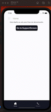

# Gerald Code Challenge

## Installation

Install dependencies

```bash
  yarn install
  cd ios
  pod install

  yarn ios
  yarn android
```

## Tech Stack

**react-native:** 0.71.4

**react-native-reanimated:** 3.1.0

**react-navigation/\*:** 6.\*

**react-sweet-state/\*:** 2.5.2

## Features

This challenge has a Custom Drawer Content with animation, Tab Buttons and Stack Navigator.

```javascript
    DrawerMenu(one in a gif)
        tab navigator (bottom tab navigation)
            home (stack navigation)
                HomeScreen
                SupportScreen
            ContactScreen
```

## Challenges

We have many Challenges in this challenge (jajaj)

psdt. I deleted styles object in the readme.

- Creating a custom drawer content.

```javascript
<DrawerContentScrollView {...drawerProps} scrollEnabled={false}>
  <Text>Beka</Text>
  <Item
    title={"Home"}
    onPress={() => navigation.navigate(TabScreenNames.Home)}
  />
  <Item
    title={"Contact"}
    onPress={() => navigation.navigate(TabScreenNames.Contact)}
  />
  <Item
    title={"Support"}
    onPress={() => navigation.navigate(TabScreenNames.Support)}
  />
</DrawerContentScrollView>
```

- Getting drawer progress to give animation for the drawer container.
  For this challenge i used react-sweet-state to manage a global state for get the progress of the drawer and with it create an animation in the next step.

```javascript
    const DrawerScreensContainer = () => {
        const progress = useDrawerProgress();
        const [{}, { setDrawerProgress }] = useSweetDrawerProgess();

        useEffect(() => {
            setDrawerProgress(progress);
        }, [progress]);
```

```javascript
const Store = createStore({
  initialState: {
    drawerProgress,
  },
  actions: {
    setDrawerProgress:
      (drawerProgress: SharedValue<number>) =>
      ({ setState }) => {
        setState({
          drawerProgress,
        });
      },
  },
  name: "drawerProgress",
});

export const useSweetDrawerProgess = createHook(Store);
```

**AppNavigator:**

```javascript
const [{ drawerProgress }] = useSweetDrawerProgess();

const animatedSubContainerStyle = useAnimatedStyle(() => {
  const translateY = interpolate(drawerProgress.value, [0, 1], [0, 40]);
  const borderRadius = interpolate(drawerProgress.value, [0, 1], [0, 30]);
  const paddingTop = interpolate(drawerProgress.value, [0, 1], [0, 50]);

  return {
    transform: [{ translateY }],
    borderRadius,
    paddingTop,
  };
});
```

- Animating at DrawerScreens

I used useDrawerProgress to create animated styles

```javascript
const progress = useDrawerProgress();
const [{}, { setDrawerProgress }] = useSweetDrawerProgess();

const animatedContainerStyles = useAnimatedStyle(() => {
  const translateX = interpolate(progress.value, [0, 1], [0, 80]);
  const translateY = interpolate(progress.value, [0, 1], [0, 20]);
  const rotateZ = `${-progress.value * 10}deg`;

  return {
    transform: [{ rotateZ }, { translateX }, { translateY }],
  };
});

const animatedSubContainerStyle = useAnimatedStyle(() => {
  const borderRadius = interpolate(progress.value, [0, 1], [0, 30]);
  const paddingTop = interpolate(progress.value, [0, 1], [0, 30]);

  return {
    borderRadius,
    paddingTop,
  };
});
```

- Getting current screen dont care navigator stack.

  I created a custom hook with "sweet-state" to set the current screen

  ```javascript
  const useSetCurrentState = () => {
    const route = useRoute();
    const [{}, { setCurrentScreen }] = useSweetCurrentScreen();

    useFocusEffect(
      React.useCallback(() => {
        setCurrentScreen(route.name);
        return () => {
          setCurrentScreen("");
        };
      }, [])
    );
  };

  export default useSetCurrentState;
  ```

## Authors

- [@agallardoysla](https://github.com/agallardoysla) React Native Developer

## Feedback

If you have any feedback, please reach out to me at agallardoysla@gmail.com

## Screenshots


